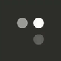

# ✨ Flutter Animation Set

[](https://pub.dartlang.org/packages/flutter_spinkit)

简化Flutter交错动画。用动画配置的形式，通过时间线去驱动Flutter的交错动画。你可以

1. 使用`Flutter Animation Set`现有的动画组件
2. 使用`Flutter Animation Set`去创建新的动画组件
3. 贡献你的`Flutter Animation Set`动画组件

## 🎖 Installing

```yaml
coming soon
```

## ⚡ Use Animation Set Widget

**1、import**

```dart
import 'package:flutter_animation_set/widget/transition_animations.dart';
import 'package:flutter_animation_set/widget/behavior_animation.dart';
```

**2、use**

```dart
child: YYRotatingPlane(),
```

**3、road map**

> transition_animations 过渡动画

<table>
  <tr>
    <td align="center">
      
      <br />
      YYRotatingPlane
      <br />
      ✅
    </td>
    <td align="center">
      
      <br />
      YYDoubleBounce
      <br />
      ✅
    </td>
    <td align="center">
      
      <br />
      YYWave
      <br />
      ✅
    </td>
    <td align="center">
      
      <br />
      YYWanderingCubes
      <br />
      ✅
    </td>
    <td align="center">
      
      <br />
      YYFadingFour
      <br />
      ✅
    </td>
    <td align="center">
      
      <br />
      YYFadingCube
      <br />
      ✅
    </td>
  </tr>
  <tr>
    <td align="center">
      
      <br />
      YYPulse
      <br />
      ✅
    </td>
    <td align="center">
      
      <br />
      YYThreeBounce
      <br />
      ✅
    </td>
    <td align="center">
      
      <br />
      YYThreeLine
      <br />
      ✅
    </td>
    <td align="center">
      
      <br />
      YYCubeGrid
      <br />
      ✅
    </td>
    <td align="center">
      
      <br />
      YYRotatingCircle
      <br />
      ✅
    </td>
    <td align="center">
      
      <br />
      YYPumpingHeart
      <br />
      ✅
    </td>
  </tr>
  <tr>
    <td align="center">
      
      <br />
      YYRipple
      <br />
      ✅
    </td>
    <td align="center">
      
      <br />
      YYRotateLine
      <br />
      ✅
    </td>
    <td align="center">
      
      <br />
      YYCubeFadeIn
      <br />
      ✅
    </td>
    <td align="center">
      
      <br />
      YYBlinkGrid
      <br />
      ✅
    </td>
  </tr>
</table>

> behavior_animation 行为动画

<table>
  <tr>
    <td align="center">
      
      <br />
      YYFadeButton
      <br />
      ✅
    </td>
    <td align="center">
      
      <br />
      YYSingleLike
      <br />
      ✅
    </td>
    <td align="center">
      
      <br />
      YYLove
      <br />
      ✅
    </td>
    <td align="center">
      
      <br />
      YYSpringMenu
      <br />
      ✅
    </td>
    <td align="center">
      
      <br />
      YYFoldMenu
      <br />
      ✅
    </td>
  </tr>
</table>

**4、thanks**

* [flutter_spinkit](https://github.com/jogboms/flutter_spinkit)

## ⚡ Create Animation Set Widget By YourSelf

**1、import**

```dart
import 'package:flutter_animation_set/animation_set.dart';
import 'package:flutter_animation_set/animator.dart';
```

**2、use api**

about animation widget

Widget|Description
:--|:--:|
W(width)|控制宽度的变化，如果是按比例拉升，建议用SX替代
H(height)|控制高度的变化，如果是按比例拉升，建议用SY替代
P(padding)|控制边距的变化
O(opacity)|控制透明度的变化
SX(scaleX)|以中点进行X轴的缩放
SY(scaleY)|以中点进行Y轴的缩放
RX(rotateX)|以中点进行X轴的旋转
RY(rotateY)|以中点进行Y轴的旋转
RZ(rotateZ)|以中点进行Z轴的旋转
TX(transitionX)|进行X轴的平移
TY(transitionY)|进行Y轴的平移
C(color)|控制背景颜色变化
B(border)|控制背景边框变化

about support widget

Widget|Description
:--|:--:|
Delay(timeDelay)|延长时间线，进入等待阶段
Serial(Combine)|通过组合动画，达到通知播放的效果

## For Example

**1、create timeLine**


<br />

1. 此图表明动画的组成是根据时间线(timeLine)去制作的
2. 如果需要延长时间线，就用Delay组件去拖长时间线，duration属性为延长的时间
3. 如果需要组合各种动画，就用Serial组件去组合动画，Serial的duration属性为组合动画时间

**2、build animatorSet**

通过上面的图示组装我们的动画组件，只需要控制好Delay的时间即可

```dart
Widget makeWave(int before, int after) {
  return AnimatorSet(
    child: Container(
      color: Colors.white,
      width: 5,
      height: 15,
    ),
    animatorSet: [
      Delay(duration: before),
      SY(from: 0.8, to: 1.6, duration: 200, delay: 0),
      SY(from: 1.6, to: 0.8, duration: 200, delay: 0),
      Delay(duration: after),
    ],
  );
}
```

* from:动画初始值
* to:动画结束值
* duration:动画时间
* delay:真正执行动画的延时

**3、convert to code**

```dart
class YYWave extends StatelessWidget {
  @override
  Widget build(BuildContext context) {
    return Container(
      width: 40,
      height: 40,
      child: Row(
        mainAxisAlignment: MainAxisAlignment.spaceBetween,
        children: <Widget>[
          makeWave(0, 500),
          makeWave(100, 400),
          makeWave(200, 300),
          makeWave(300, 200),
          makeWave(400, 100),
          makeWave(500, 0),
        ],
      ),
    );
  }
}
```

**4、done**


<br />

## More

**1、组合动画**


**2、延时动画**

## Bugs/Requests

* If your application has problems, please submit your code and effect to Issue.
* Pull request are also welcome.

## Contribution

Contribute your component, and we'll add it to the animation set

## About

QQ群:

## License

MIT License
